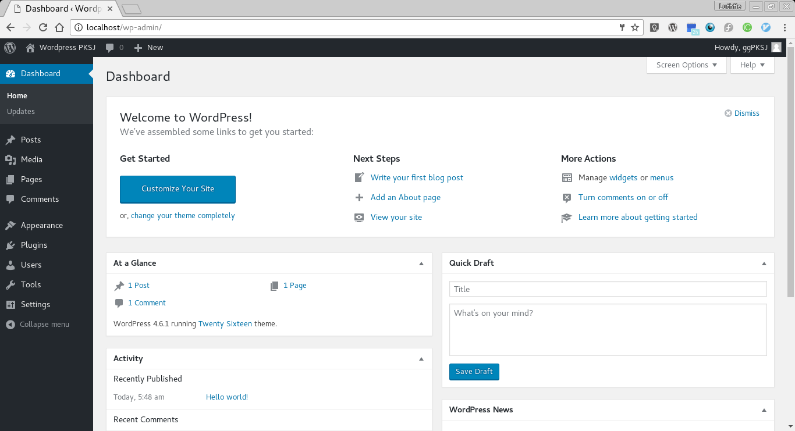
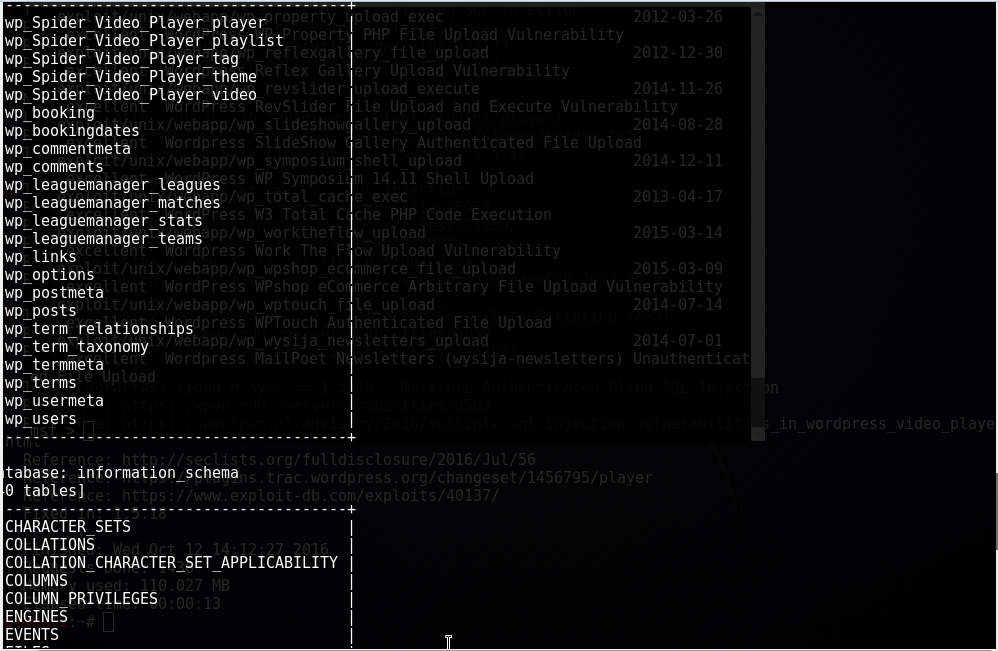

# PKSJ - Tugas 2

## Pendahuluan

**Anggota Kelompok**

| NRP         | Nama                     |
|-------------|--------------------------|
| 5113100050  | Freddy Hermawan Y        |
| 5113100109  | Daniel Fablius           |
| 5113100113  | Muhamad Luthfie La Roeha |

#### Penjelasan Tugas
**Tugas 2 :**
* Instal Wordpress pada sebuah virtual OS
* Instal plugin yang vulnerable terhadap SQL injection
* Instal/gunakan tool untuk uji SQL injection pada Wordpress
* Lakukan uji sql injection, scan vulnability dan catat hasil uji penetrasi 


## Dasar Teori


**1. OS yang digunakan**

* **Kali Linux** adalah 
salah satu distribusi Linux tingkat lanjut untuk Penetration Testing dan audit keamanan, pembangunan kembali BackTrack Linux secara sempurna,  mengikuti sepenuhnya kepada standar pengembangan Debian.(http://id.docs.kali.org/introduction-id/apa-itu-kali-linux)

* **Ubuntu Server** adalah 
suatu desain ubuntu yang digunakan untuk diinstall di lingkungan enterprise atau perusahaan untuk keperluan seperti web server ataupun router, secara default versi server ini tidak menyertakan antarmuka GUI, yang ada hanya shell alias Command line,aplikasi bawaan dari ubuntu server sekedar info buat anda berupa aplikasi serveri webserver, DNS server, DHCP server, firewall, openSSH, dan applikasi yang berhubungan dengan server, teknologi yang dibenamkan diserver juga umumnya hanya dipakai oleh orang yang benar benar advanced di Linux. (https://etix.wordpress.com/2010/01/28/perbedaan-ubuntu-server-dan-desktop/)

**2. Tools yang digunakan**

*Wordpress Plugin*

* **Video Player v. 1.5.16**, 
adalah plugin Wordpress yang menyediakan fitur untuk memasukkan video ke website Wordpress.
Video Player ini dapat diunduh di halaman ini (https://wordpress.org/plugins/player/developers/)

* **League Manager 3.9.11**,
Plugin ini digunakan untuk menampilkan hasil dari pertandingan sepak bola pada website wordpress.
Plugin ini dapat diunduh pada halaman berikut (https://wordpress.org/plugins/leaguemanager/developers/).

*Tools*

* **Sql Map** 
tools opensource yang mendeteksi dan melakukan exploit pada bug SQL injection secara otomatis. dengan melakukan serangan SQL injection seorang attacker dapat mengambil alih serta memanipulasi sebuah database di dalam sebuah server.
SQLMap dapat diunduh pada link berikut (https://github.com/sqlmapproject/sqlmap/zipball/master)

* **Wpscan** 
merupakan tools vulnerability scanner untuk CMS Wordpress yang ditulis dengan menggunakan bahasa pemrograman ruby, WPScan mampu mendeteksi kerentanan umum serta daftar semua plugin dan themes yang digunakan oleh sebuah website yang menggunakan CMS Wordpress.
WPScan dapat diunduh pada link berikut (https://github.com/wpscanteam/wpscan/zipball/master)

* **NTO sql Invader** 
adalah tools yang digunakan untuk mendeteksi SQL Injection Vulnerabilities pada suatu aplikasi web. 
NTO sql Invader dapat diunduh pada link berikut (http://ntosqlinvader.software.informer.com/download/)

## Persiapan

#### 1. Langkah Instalasi Wordpress

  1. Pastikan LAMP (Linux, Apache, MySQL, and PHP) stack sudah terinstal


  2. Unduh versi terbaru dari Wordpress
  ```
  $ cd /tmp
  $ wget http://wordpress.org/latest.tar.gz
  ```

  3. Ekstrak file yang telah diunduh, ke dalam folder `/var/www/html`
  ```
  $ tar -xvzf latest.tar.gz -C /var/www/html
  ```

  4. Login ke MySQL milik user `root`
  ```
  $ mysql -u root -p
  ```

  5. Buat database yang akan digunakan Wordpress
  ```
  mysql> CREATE DATABASE wordpress
  ```

  6. Buat user yang digunakan untuk mengoperasikan database Wordpress
  ```
  mysql> CREATE USER wordpress@localhost IDENTIFIED BY "masukkan_password_disini";
  ```

  7. Berikan hak akses ke database `wordpress` untuk user yang baru dibuat
  ```
  mysql> GRANT ALL ON wordpress.* TO wordpress@localhost;
  ```

  8. Flush aturan hak akses yang telah ditetapkan agar MySQL yang sedang berjalan dapat mengetahui perubahan aturan hak akses, kemudian keluar dari MySQL
  ```
  mysql> FLUSH PRIVILEGES;
  mysql> exit;
  ```

  9. Pindah ke direktori `/var/www/html/wordpress`, kemudian salin `wp-config-sample.php` ke file `wp-config.php`
  ```
  $ cd /var/www/html/wordpress;
  $ cp wp-config-sample.php wp-config.php;
  ```

  10. Buka file `wp-config.php` menggunakan teks editor, kemudian ubah isi variable dari `DB_NAME`, `DB_USER`dan `DB_PASSWORD` sesuai dengan nilai yang telah anda tentukan pada langkah 5 dan 6
  ```
  $ vi wp-config.php
  ```

  11. Contoh tampilan dari konfigurasi Wordpress yang digunakan pada tutorial 


  12. Buka web browser, kemudian masukkan alamat Wordpress anda (misal `http://localhost`. Jika Wordpress berjalan maka akan muncul tampilan seperti di gambar.


  13. Masukkan informasi yang akan digunakan untuk membuat akun admin  Wordpress. Setelah selesai, klik tombol `Install Wordpress`


  14. Login ke Wordpress anda menggunakan akun admin yang telah dibuat


  15. Tampilan dashboard dari Wordpress



#### 2. Install Wordpress Plugin


## Uji Sql Injection

#### 1. Uji Sql Injection dengan Wpscan

Pada tahap ini, kami melakukan sebuah skenario uji sql injection, yaitu :
1. Memindai semua vulnability yang terdapat dalam wordpress plugin yang telah di install


**Skenario 1** : Memindai semua vulnability yang terdapat dalam wordpress plugin yang telah di install

-  Menggunakan *Wpscan* untuk melakukan pindai yang terdapat vulnability dalam wordpress plugin dengan cara :
```
wpscan -u 10.151.36.5/html --enumerate vp
```

- Tunggu hingga proses Scanning selesai dilakukan. Seperti dibawah ini :


####2. Uji Sql Injection terhadap plugin wordpress leaguemanager v.3.9.11

Pada tahap ini, kami melakukan 2 skenario uji sql injection terhadap leaguemanager plugin, yaitu :
1. melakukan brute force sql injection yang terdapat dalam leaguemanager yang telah diinstall

**Skenario 1** : melakukan brute force sql injection yang terdapat dalam leaguemanager yang telah diinstall untuk dari match

-  Menggunakan *Sql Map* untuk melakukan sql injection terhadap leaguemanager untuk menggambil semua tables yang ada.
```
sqlmap -u "http://10.151.36.5/html/2016/10/12/match/?match=1" --dbms mysql --level 5 --risk 3 --tables
```


Hasil Uji dengan sqlmap dengan command seperti diatas adalah





**Skenario 2** : melakukan brute force sql injection yang terdapat dalam leaguemanager yang telah diinstall untuk dari season

-  Menggunakan *Sql Map* untuk melakukan sql injection terhadap leaguemanager untuk menggambil semua tables yang ada.
```
sqlmap -u "http://10.151.36.5/html/2016/10/12/tik/?page_id=8&&season=1&&league_id=1&&match_day=1&&team_id=3" --dbms mysql --level 5 --risk 3 --tables
```


Hasil Uji dengan sqlmap dengan command seperti diatas adalah


- Menggunakan SqlMap untuk mendapatkan isi dari table wp_users.
```
python sqlmap.py --url "http://10.151.36.5/html/index.php/2016/10/12/tik/?match=3" --dbms mysql --level 5 --risk 3 -D wordpress -T wp_users --dump
```
Hasil Uji dengan sqlmap dengan command seperti diatas adalah


Sumber referensi : 
https://www.exploit-db.com/exploits/37182/
https://github.com/sqlmapproject/sqlmap/wiki/Usage

####3. Uji Sql Injection terhadap plugin wordpress video player v.1.5.16

Pada tahap ini, kami melakukan sebuah skenario uji sql injection terhadap video player plugin, yaitu :
1. melakukan brute force sql injection yang terdapat dalam video player yang telah diinstall

**Skenario 1** : menggunakan NTO sql invader untuk melakukan cek parameter yang mungkin terdapat vulnerable terhadap sql injection yang terdapat dalam post method.

- Menggunakan NTO sql invader untuk melakukan pengecekan terhadap parameter yang mungkin terdapat vulnerable terhadap sql injection yang terdapat dalam post method

Hasil uji coba


Sumber referensi : https://www.exploit-db.com/exploits/40137/

## Kesimpulan dan Saran
1. Terdapat Banyak Plugin Wordpress yang dapat di eksploitasi menggunakan banyak cara. salah satu caranya adalah menggunakan sql injection.
2. Untuk Menanganai hal ini, para pengguna web wordpress harus terus up to date dengan segala informasi terbaru mengenai plugin wordpress yang digunakan.
